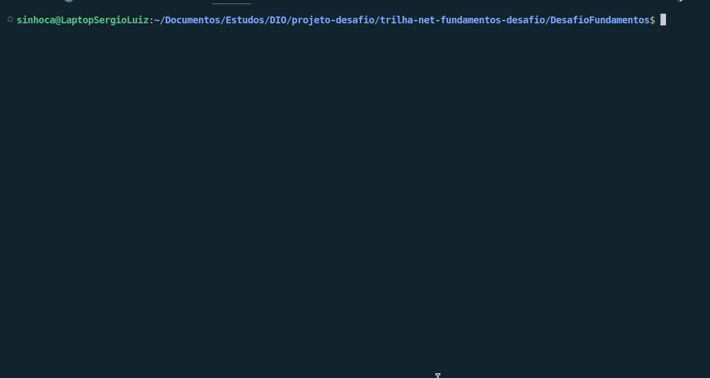

# DIO - Trilha .NET - Fundamentos
www.dio.me

## Desafio de projeto
Para este desafio, você precisará usar seus conhecimentos adquiridos no módulo de fundamentos, da trilha .NET da DIO.

## Contexto
Você foi contratado para construir um sistema para um estacionamento, que será usado para gerenciar os veículos estacionados e realizar suas operações, como por exemplo adicionar um veículo, remover um veículo (e exibir o valor cobrado durante o período) e listar os veículos.

## Proposta
Você precisará construir uma classe chamada "Estacionamento", conforme o diagrama abaixo:

A classe contém três variáveis, sendo:

**precoInicial**: Tipo decimal. É o preço cobrado para deixar seu veículo estacionado.

**precoPorHora**: Tipo decimal. É o preço por hora que o veículo permanecer estacionado.

**veiculos**: É uma lista de string, representando uma coleção de veículos estacionados. Contém apenas a placa do veículo.

A classe contém três métodos, sendo:

**AdicionarVeiculo**: Método responsável por receber uma placa digitada pelo usuário e guardar na variável **veiculos**.

**RemoverVeiculo**: Método responsável por verificar se um determinado veículo está estacionado, e caso positivo, irá pedir a quantidade de horas que ele permaneceu no estacionamento. Após isso, realiza o seguinte cálculo: **precoInicial** * **precoPorHora**, exibindo para o usuário.

**ListarVeiculos**: Lista todos os veículos presentes atualmente no estacionamento. Caso não haja nenhum, exibir a mensagem "Não há veículos estacionados".

Por último, deverá ser feito um menu interativo com as seguintes ações implementadas:
1. Cadastrar veículo
2. Remover veículo
3. Listar veículos
4. Encerrar

# Solução 
 Minhas implementações foram feitas para resolver o desafio proposto, aprimorando o sistema com várias melhorias que garantem uma experiência de usuário fluida e robusta.

 **Versão da Plataforma:**   Este projeto foi desenvolvido utilizando a plataforma **.NET versão 8.**

 ## Implementações na Classe `Estacionamento.cs`

### Implementações Requeridas

1 **Adicionar Veículo (`AdicionarVeiculo` método):**
  
- **Entrada de Placa:** O usuário é solicitado a inserir a placa do veículo. A placa é validada e, se for válida e não duplicada, é adicionada à lista de veículos estacionados.

- **Validação e Tentativas:** A validação é realizada para garantir que a placa esteja no formato correto e não seja duplicada. O sistema permite até duas tentativas inválidas antes de oferecer a opção de sair.

2 **Remover Veículo (`RemoverVeiculo` método):** 

- **Entrada de Placa:** O usuário é solicitado a inserir a placa do veículo a ser removido.

- **Cálculo do Valor:** A quantidade de horas é solicitada ao usuário, e o valor total é calculado usando a fórmula: `precoInicial + precoPorHora * horas`.

- **Remoção da Placa:** Após calcular o valor total, a placa do veículo é removida da lista de veículos estacionados.

3 **Listar Veículos (ListarVeiculos método):**
- **Listagem:** O método exibe todos os veículos atualmente estacionados, numerando-os para melhor visualização.

## Implementações na Classe `Program.cs`

### Funções de Inicialização e Validação

**1 Inicialização de Variáveis:**

- **Definição de Preços:** As variáveis precoInicial e precoPorHora são definidas para armazenar os valores iniciais e por hora do estacionamento.

**2 Função LerDecimal:**

- **Entrada de Dados:** Implementada para solicitar e validar a entrada de valores decimais pelo usuário.

- **Validação:** Se a entrada não for válida, o usuário é solicitado a inserir novamente até que um valor decimal válido seja fornecido.

**3 Inicialização do Estacionamento:**

- **Configuração Inicial:** O sistema lê e valida os preços inicial e por hora utilizando a função `LerDecimal` antes de instanciar a classe Estacionamento.

## Implementações Adicionais
**1 Validação da Placa:**

- **Tentativas e Validação:** Implementado um contador de tentativas e uma validação rigorosa para garantir que a placa inserida esteja no formato correto e não seja duplicada.

- **Formato da Placa:** Utiliza uma expressão regular para garantir que a placa esteja no formato Mercosul: três letras seguidas por um hífen e quatro números `(exemplo: ABC-1234)`.

 **2 Tratamento de Erros e Saída do Menu:**

- **Verificação de Entrada:** Implementado tratamento para verificar se as entradas são números válidos e exibir mensagens de erro apropriadas se a entrada for inválida.

- **Saída do Processo de Adição:** Permite que o usuário saia do processo de adição de veículo pressionando a tecla 4 após exceder o número de tentativas.

**3 Melhorias na Interação com o Usuário:**

- **Mensagens Informativas:** Adicionadas mensagens para informar ao usuário sobre a validação da placa, erros, e o resultado das operações `(adição, remoção e listagem de veículos)`.

## Demonstração do Sistema

Aqui está uma breve demonstração em vídeo do sistema de estacionamento em ação:

Este vídeo ilustra como adicionar veículos, remover veículos e listar os veículos estacionados, mostrando a interface do usuário e as interações principais.

 

    
 

